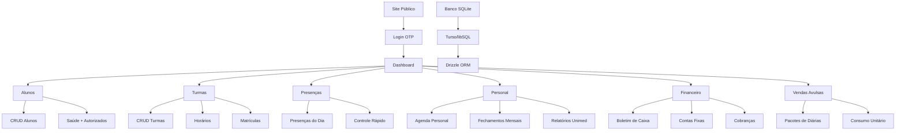

# Academia Infantil - Sistema de Gestão

Sistema completo para gestão de academia infantil com foco em contraturno, personal training e modalidades esportivas. Desenvolvido para resolver as principais dores operacionais e financeiras do negócio.

## 🎯 Principais Funcionalidades

### ✅ Contraturno
- Contratos trimestrais/semestrais/anuais com recorrência
- Acompanhamento pedagógico completo
- Gestão de matrículas e presenças

### ✅ Personal Training
- Atendimentos individuais por criança
- Pagamento consolidado (Unimed/Particular)
- Fechamentos mensais com relatórios

### ✅ Academia (Modalidades)
- Mensal sem amarração
- Diárias/pacotes (colônia de férias/aulas avulsas)
- **Sem necessidade de "abrir 5 contratos"** - venda de pacotes com consumo unitário

### ✅ Financeiro
- Boletim de caixa completo
- Contas fixas com geração mensal automática
- Cobranças e controle de inadimplência
- Relatórios financeiros

## 🛠️ Stack Tecnológica

- **Frontend**: Next.js 15 (App Router) + React + TypeScript
- **Styling**: Tailwind CSS + shadcn/ui
- **Backend**: Next.js API Routes
- **Database**: SQLite (Turso/libSQL) + Drizzle ORM
- **Auth**: Login por OTP via e-mail + cookies httpOnly
- **Validação**: Zod
- **PDFs**: jsPDF
- **Deploy**: Vercel + Turso (custo quase zero)

## 📁 Estrutura do Projeto

```
src/
├── app/                    # App Router do Next.js
│   ├── api/               # API Routes
│   │   └── auth/          # Autenticação OTP
│   ├── dashboard/         # Painel administrativo
│   ├── alunos/            # Gestão de alunos
│   ├── presencas/         # Controle de presenças
│   ├── personal/          # Personal training
│   ├── vendas/            # Vendas avulsas e pacotes
│   ├── financeiro/        # Gestão financeira
│   ├── modalidades/       # Página pública de modalidades
│   ├── horarios/          # Página pública de horários
│   ├── matricula/         # Processo de matrícula
│   └── experimental/      # Aula experimental
├── components/
│   └── ui/                # Componentes shadcn/ui
├── lib/                   # Utilitários e configurações
├── server/                # Serviços e lógica de negócio
│   ├── db/                # Database (Drizzle + Turso)
│   ├── services/          # Serviços de negócio
│   ├── auth/              # Autenticação
│   ├── mailer/            # Envio de emails
│   ├── pdf/               # Geração de PDFs
│   └── payments/          # Integração de pagamentos
└── middleware.ts          # Proteção de rotas
```

## 🚀 Setup e Instalação

### 1. Clone e Instale Dependências

```bash
git clone <repository-url>
cd academia-infantil
npm install
```

### 2. Configure Variáveis de Ambiente

Copie o arquivo `.env.example` para `.env.local`:

```bash
cp .env.example .env.local
```

Configure as variáveis:

```env
DATABASE_URL="libsql://<nome>.turso.io"
DATABASE_AUTH_TOKEN="<token>"
SMTP_HOST="smtp.seudominio.com"
SMTP_PORT="587"
SMTP_USER="no-reply@seudominio.com"
SMTP_PASS="senha"
APP_URL="http://localhost:3000"
NEXTAUTH_SECRET="your-secret-key-here"
```

### 3. Configure o Banco de Dados

```bash
# Push do schema para o banco
npm run db:push

# (Opcional) Abrir Drizzle Studio para visualizar dados
npm run db:studio

# Popular com dados de exemplo
npm run db:seed
```

### 4. Execute o Projeto

```bash
# Desenvolvimento
npm run dev

# Build para produção
npm run build
npm run start
```

## 📊 Diagrama do Sistema



## 🔄 Fluxos Principais

### Matrícula
1. Responsável acessa `/matricula`
2. Preenche dados pessoais
3. Seleciona modalidade/turma
4. Aceita contrato (PDF gerado)
5. Confirma matrícula

### Personal Training
1. Professor agenda sessão individual
2. Marca presença (feito/faltou)
3. Sistema consolida por pagador
4. Gera fechamento mensal
5. Exporta relatório para Unimed

### Vendas Avulsas
1. Vende pacote de N diárias
2. Aluno consome com 1 clique
3. Sistema decrementa créditos
4. Registra histórico de uso

### Fechamento Financeiro
1. Gera cobranças mensais automáticas
2. Contas fixas são criadas automaticamente
3. Boletim de caixa registra entradas/saídas
4. Relatórios mostram projeção vs realizado

## 👥 Perfis de Usuário

### Admin
- Acesso total ao sistema
- Gestão de usuários
- Relatórios financeiros

### Gestor
- Gestão operacional
- Acesso ao financeiro
- Relatórios gerenciais

### Professor
- Presenças do dia
- Agenda personal
- Visualização de alunos

### Responsável
- Acesso limitado
- Visualização de matrículas do filho

## 🔐 Autenticação

Sistema de autenticação por OTP via e-mail:
1. Usuário digita e-mail
2. Recebe código de 6 dígitos
3. Insere código para entrar
4. Sessão válida por 30 dias

## 📱 Mobile-First

Interface otimizada para uso em dispositivos móveis:
- Presenças com marcação rápida
- Dashboard responsivo
- Formulários adaptados para touch

## 💰 Integração de Pagamentos

Preparado para Mercado Pago:
- Stubs implementados
- Webhook configurado
- Botões de checkout prontos

## 🎯 Dados de Exemplo

O sistema inclui dados de demonstração:
- 4 usuários (admin, gestor, 2 professores)
- 2 alunos com dados completos
- 3 modalidades configuradas
- 2 turmas com horários
- 1 pacote de diárias vendido
- 3 sessões de personal
- Contas fixas modelo

## 📈 Relatórios Disponíveis

- Frequência por turma/período
- Inadimplência por referência
- Receita por setor
- Fechamento Personal (detalhe por criança/profissional/pagador)
- Projeção vs Realizado
- Taxa de utilização de pacotes

## 🔧 Scripts Disponíveis

```bash
npm run dev          # Desenvolvimento
npm run build        # Build produção
npm run start        # Produção
npm run lint         # Linting
npm run db:push      # Push schema
npm run db:studio    # Interface visual do banco
npm run db:generate  # Gerar migrations
npm run db:migrate   # Executar migrations
npm run db:seed      # Popular com dados exemplo
```

## 🚀 Deploy

### Vercel (Recomendado)
1. Conecte o repositório ao Vercel
2. Configure as variáveis de ambiente
3. Deploy automático

### Turso Database
1. Crie conta no Turso
2. Configure DATABASE_URL e AUTH_TOKEN
3. Execute `npm run db:push`

## ⚠️ Pontos Críticos para Deploy

1. **Variáveis de Ambiente**: Configure SMTP e DATABASE_URL
2. **Segurança**: NEXTAUTH_SECRET com 32+ caracteres
3. **Backups**: Configure backup automático do Turso
4. **Limites**: Monitore uso do free tier (Vercel + Turso)
5. **Emails**: Teste envio de OTP em produção

## 🔄 Próximos Passos

### Fase 1 - Ativação Completa
- [ ] Configurar SMTP real
- [ ] Ativar Mercado Pago
- [ ] Configurar backup automático
- [ ] Testes em produção

### Fase 2 - Melhorias
- [ ] App mobile nativo
- [ ] Notificações push
- [ ] Integração com WhatsApp
- [ ] Dashboard analítico avançado

### Fase 3 - Expansão
- [ ] Multi-tenancy
- [ ] API pública
- [ ] Integração com sistemas externos
- [ ] IA para recomendações

## 📞 Suporte

Para dúvidas ou suporte:
- Email: suporte@academiainfantil.com
- Documentação: [Link para docs]
- Issues: [Link para GitHub Issues]

---

**Academia Infantil** - Desenvolvendo o futuro através do esporte e educação 🏃‍♂️✨
